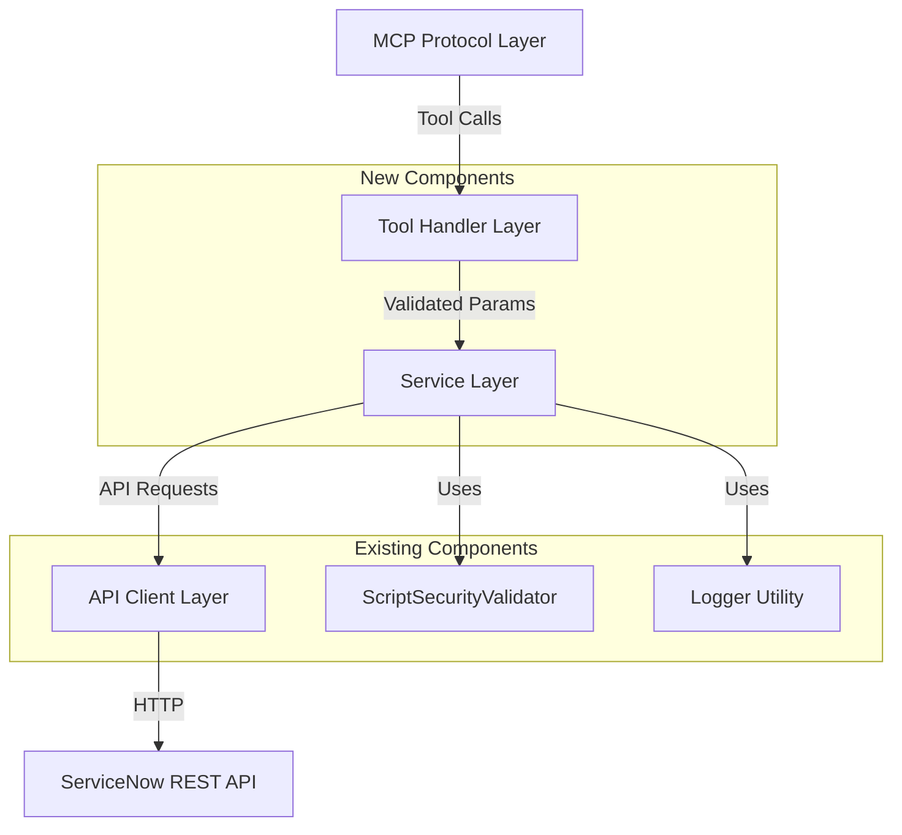
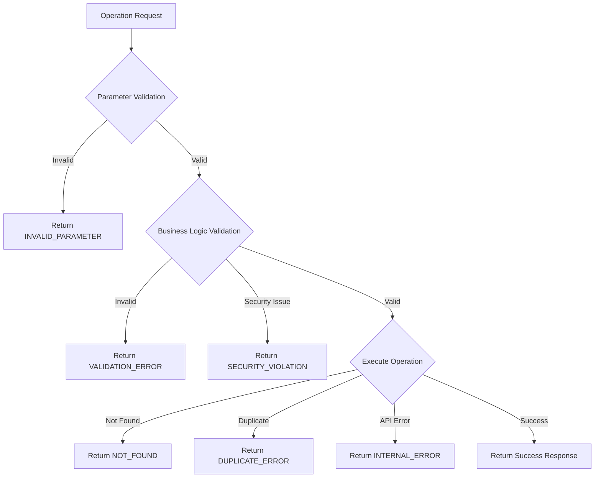

# Design Document: Script Include Management

## Overview

This design implements Script Include management capabilities for the ServiceNow MCP Server, enabling AI assistants to create, read, update, delete, query, validate, and test Script Includes. The implementation follows the established four-layer architecture pattern used throughout the codebase:

1. **MCP Protocol Layer** - Tool definitions and parameter schemas
2. **Tool Handler Layer** - Parameter validation and orchestration
3. **Service Layer** - Business logic and data transformation
4. **API Client Layer** - ServiceNow REST API communication

The design leverages existing components (ServiceNowClient, ScriptSecurityValidator, logger) and follows patterns established by IncidentService, UserService, and other entity services. Script Includes are server-side JavaScript libraries stored in the sys_script_include table that provide reusable functions and classes for ServiceNow applications.

### Key Design Decisions

- **Security-First Approach**: All JavaScript code is validated before creation/update using the existing ScriptSecurityValidator with Script Include-specific patterns
- **Flexible Identification**: Script Includes can be retrieved by sys_id or api_name for developer convenience
- **Comprehensive Validation**: Validates Script Include patterns (class-based, on-demand, GlideAjax) and ensures proper structure
- **Testing Support**: Provides method testing capability to verify Script Include functionality before deployment
- **Consistent Error Handling**: Uses standardized error codes and structured responses across all operations

## Architecture

### Component Diagram



### Layer Responsibilities

**MCP Protocol Layer**
- Defines 8 tool schemas: create_script_include, get_script_include, update_script_include, delete_script_include, query_script_includes, list_recent_script_includes, validate_script_include, test_script_include
- Specifies parameter types and descriptions using JSON Schema
- Registers tools with the MCP server

**Tool Handler Layer**
- Validates parameter types and constraints
- Enforces business rules (e.g., limit ranges, required fields)
- Orchestrates service layer calls
- Transforms service responses to tool response format
- Handles errors and returns structured error responses

**Service Layer (ScriptIncludeService)**
- Implements business logic for all Script Include operations
- Validates JavaScript code using ScriptSecurityValidator
- Validates Script Include patterns (class-based, on-demand, GlideAjax)
- Builds ServiceNow encoded queries from filters
- Transforms ServiceNow records to typed objects
- Logs operations with timing information

**API Client Layer (ServiceNowClient)**
- Executes HTTP requests to ServiceNow Table API
- Handles authentication and connection management
- Provides generic CRUD methods (get, getById, post, put, delete)
- Manages error responses from ServiceNow

## Components and Interfaces

### ScriptIncludeService

The core service class that implements all Script Include business logic.

```typescript
class ScriptIncludeService {
  private client: ServiceNowClient;
  private securityValidator: ScriptSecurityValidator;

  constructor(client: ServiceNowClient);

  // CRUD Operations
  async createScriptInclude(data: CreateScriptIncludeData): Promise<string>;
  async getScriptInclude(identifier: string): Promise<ScriptIncludeDetail | null>;
  async updateScriptInclude(sysId: string, updates: UpdateScriptIncludeData): Promise<string>;
  async deleteScriptInclude(sysId: string): Promise<void>;

  // Query Operations
  async queryScriptIncludes(filters: ScriptIncludeFilters): Promise<ScriptIncludeSummary[]>;
  async listRecentScriptIncludes(limit: number): Promise<ScriptIncludeSummary[]>;

  // Validation and Testing
  async validateScript(script: string): Promise<ScriptValidationResult>;
  async testScriptInclude(sysId: string, methodName: string, params: TestMethodParams): Promise<TestResult>;

  // Private Helper Methods
  private validateScriptIncludePattern(data: CreateScriptIncludeData): void;
  private validateAccessLevel(access: string): void;
  private buildQuery(filters: ScriptIncludeFilters): string;
  private toScriptIncludeSummary(record: ServiceNowRecord): ScriptIncludeSummary;
  private toScriptIncludeDetail(record: ServiceNowRecord): ScriptIncludeDetail;
}
```

### Tool Handlers

Eight handler functions that validate parameters and orchestrate service calls:

```typescript
// Creation and Modification
async function createScriptIncludeHandler(
  params: CreateScriptIncludeParams,
  service: ScriptIncludeService
): Promise<CreateScriptIncludeResponse | ErrorResponse>;

async function updateScriptIncludeHandler(
  params: UpdateScriptIncludeParams,
  service: ScriptIncludeService
): Promise<UpdateScriptIncludeResponse | ErrorResponse>;

async function deleteScriptIncludeHandler(
  params: DeleteScriptIncludeParams,
  service: ScriptIncludeService
): Promise<DeleteScriptIncludeResponse | ErrorResponse>;

// Retrieval and Query
async function getScriptIncludeHandler(
  params: GetScriptIncludeParams,
  service: ScriptIncludeService
): Promise<GetScriptIncludeResponse | ErrorResponse>;

async function queryScriptIncludesHandler(
  params: QueryScriptIncludesParams,
  service: ScriptIncludeService
): Promise<QueryScriptIncludesResponse | ErrorResponse>;

async function listRecentScriptIncludesHandler(
  params: ListRecentScriptIncludesParams,
  service: ScriptIncludeService
): Promise<ListRecentScriptIncludesResponse | ErrorResponse>;

// Validation and Testing
async function validateScriptIncludeHandler(
  params: ValidateScriptIncludeParams,
  service: ScriptIncludeService
): Promise<ValidateScriptIncludeResponse | ErrorResponse>;

async function testScriptIncludeHandler(
  params: TestScriptIncludeParams,
  service: ScriptIncludeService
): Promise<TestScriptIncludeResponse | ErrorResponse>;
```

### Security Validation

The existing ScriptSecurityValidator will be extended with Script Include-specific patterns:

```typescript
// Additional blacklisted patterns for Script Includes
const SCRIPT_INCLUDE_BLACKLIST = [
  /eval\s*\(/i,                    // Arbitrary code execution
  /new\s+Function\s*\(/i,          // Dynamic function creation
  /require\s*\(/i,                 // Module loading
  /import\s+/i,                    // ES6 imports
  /GlideHTTPRequest/i,             // Unrestricted HTTP
  /RESTMessageV2/i,                // REST without config
  /SOAPMessageV2/i,                // SOAP without config
  /XMLDocument/i,                  // XXE vulnerabilities
  /gs\.executeNow\s*\(/i,          // Immediate execution
  /\.readFile\(/i,                 // File system access
  /\.writeFile\(/i,                // File system write
  /\.getFile\(/i,                  // File system access
  /\.setFile\(/i,                  // File system write
  /fs\./i,                         // File system module
];

// Discouraged patterns (warnings, not errors)
const DISCOURAGED_PATTERNS = [
  /new\s+GlideRecord\s*\(/i,       // Recommend GlideQuery
  /gs\.print\s*\(/i,               // Recommend proper logging
];
```

### Pattern Validation

Script Include patterns are validated based on their type:

```typescript
interface PatternValidation {
  // Class-Based Script Include
  validateClassBased(script: string, apiName: string): boolean;
  
  // On-Demand Script Include
  validateOnDemand(script: string, apiName: string): boolean;
  
  // GlideAjax Script Include (Client-Callable)
  validateGlideAjax(script: string, apiName: string): boolean;
}

// Validation logic:
// - Class-based: Must contain "Class.create()" and "type: 'ApiName'"
// - On-demand: Function name must match api_name
// - GlideAjax: Must extend AbstractAjaxProcessor when client_callable is true
```

## Data Models

### TypeScript Types

```typescript
/**
 * Summary view of a Script Include (used in query/list operations)
 */
interface ScriptIncludeSummary {
  sys_id: string;
  name: string;
  api_name: string;
  active: boolean;
  access: string;
  client_callable: boolean;
  sys_updated_on: string;
}

/**
 * Detailed view of a Script Include (used in get operations)
 */
interface ScriptIncludeDetail extends ScriptIncludeSummary {
  script: string;
  description: string | null;
  sys_created_on: string;
  sys_created_by: string;
  sys_updated_by: string;
  sys_mod_count: number;
}

/**
 * Filter parameters for querying Script Includes
 */
interface ScriptIncludeFilters {
  name?: string;              // Partial match, case-insensitive
  api_name?: string;          // Exact match
  active?: boolean;           // Filter by active status
  access?: string;            // Filter by access level
  client_callable?: boolean;  // Filter by client-callable flag
  query?: string;             // Custom encoded query
  limit?: number;             // Max results (1-100, default 25)
}

/**
 * Data for creating a Script Include
 */
interface CreateScriptIncludeData {
  name: string;
  api_name: string;
  script: string;
  active?: boolean;
  access?: string;
  description?: string;
  client_callable?: boolean;
}

/**
 * Data for updating a Script Include
 */
interface UpdateScriptIncludeData {
  name?: string;
  api_name?: string;
  script?: string;
  active?: boolean;
  access?: string;
  description?: string;
  client_callable?: boolean;
}

/**
 * Script validation result
 */
interface ScriptValidationResult {
  valid: boolean;
  warnings: ValidationMessage[];
  errors: ValidationMessage[];
}

interface ValidationMessage {
  type: string;
  message: string;
  detail: string;
}

/**
 * Test method parameters
 */
interface TestMethodParams {
  method_name: string;
  parameters?: Record<string, any>;
  initialize_params?: any[];
}

/**
 * Test execution result
 */
interface TestResult {
  success: boolean;
  result?: any;
  error?: string;
  executionTime: number;
  logs: string[];
}
```

### ServiceNow Table Mapping

The sys_script_include table fields map to our types as follows:

| ServiceNow Field | TypeScript Field | Type | Notes |
|-----------------|------------------|------|-------|
| sys_id | sys_id | string | Unique identifier |
| name | name | string | Display name |
| api_name | api_name | string | Unique API name |
| script | script | string | JavaScript code |
| active | active | boolean | Active status |
| access | access | string | "public", "package_private", or "private" |
| description | description | string \| null | Optional description |
| client_callable | client_callable | boolean | GlideAjax flag |
| sys_created_on | sys_created_on | string | Creation timestamp |
| sys_created_by | sys_created_by | string | Creator user |
| sys_updated_on | sys_updated_on | string | Update timestamp |
| sys_updated_by | sys_updated_by | string | Last updater |
| sys_mod_count | sys_mod_count | number | Modification count |


## Correctness Properties

A property is a characteristic or behavior that should hold true across all valid executions of a system—essentially, a formal statement about what the system should do. Properties serve as the bridge between human-readable specifications and machine-verifiable correctness guarantees.

### Core CRUD Properties

**Property 1: Create-Retrieve Round Trip**
*For any* valid Script Include data, creating a Script Include and then retrieving it by sys_id should return a Script Include with all the same field values.
**Validates: Requirements 1.1, 2.1**

**Property 2: Create-Retrieve by API Name Round Trip**
*For any* valid Script Include data, creating a Script Include and then retrieving it by api_name should return the same Script Include.
**Validates: Requirements 1.1, 2.2**

**Property 3: Update Persistence**
*For any* existing Script Include and any valid update data, updating the Script Include and then retrieving it should reflect all the updated field values.
**Validates: Requirements 3.1, 3.9**

**Property 4: Delete Removes Script Include**
*For any* existing Script Include, deleting it by sys_id and then attempting to retrieve it should return found: false.
**Validates: Requirements 4.1**

### Input Validation Properties

**Property 5: Required Fields Validation**
*For any* Script Include creation request missing name or api_name fields, the system should reject the request with an INVALID_PARAMETER error.
**Validates: Requirements 1.2, 1.3**

**Property 6: Access Level Enum Validation**
*For any* Script Include creation or update request with an access level that is not "public", "package_private", or "private", the system should reject the request with a VALIDATION_ERROR.
**Validates: Requirements 1.5, 3.5, 5.11**

**Property 7: Parameter Type Validation**
*For any* operation with a required string parameter (identifier, sys_id, method_name), providing a non-string value should result in an INVALID_PARAMETER error.
**Validates: Requirements 2.4, 2.5, 4.2, 4.3, 8.7, 8.8**

**Property 8: Empty Update Rejection**
*For any* update request with no update fields provided, the system should reject the request with an INVALID_PARAMETER error.
**Validates: Requirements 3.8**

### Security Validation Properties

**Property 9: Dangerous Pattern Detection**
*For any* JavaScript code containing blacklisted patterns (eval, Function constructor, require, import, GlideHTTPRequest, RESTMessageV2, SOAPMessageV2, XMLDocument, file system access), the system should reject creation or update with a SECURITY_VIOLATION error.
**Validates: Requirements 1.6, 1.7, 3.3, 3.4, 7.2, 7.5, 9.1, 9.2, 9.3, 9.5**

**Property 10: Script Length Limit Enforcement**
*For any* JavaScript code exceeding the maximum allowed length, the system should reject creation or update with a VALIDATION_ERROR.
**Validates: Requirements 1.8, 7.6, 9.4**

**Property 11: Syntax Validation**
*For any* JavaScript code with syntax errors, the system should reject creation or update with a VALIDATION_ERROR containing syntax error details.
**Validates: Requirements 1.4, 3.2, 7.1, 7.4**

**Property 12: Discouraged Pattern Warnings**
*For any* JavaScript code containing discouraged patterns (GlideRecord, gs.print), the validation should return valid: true with warnings, not errors.
**Validates: Requirements 7.8, 7.9, 9.8**

**Property 13: Validation Result Structure**
*For any* script validation request, the response should contain valid (boolean), warnings (array), and errors (array) fields.
**Validates: Requirements 7.3, 7.4, 7.5, 7.6**

### Pattern Validation Properties

**Property 14: Client-Callable Pattern Validation**
*For any* Script Include creation request with client_callable set to true, the script must extend AbstractAjaxProcessor or the request should be rejected with a VALIDATION_ERROR.
**Validates: Requirements 1.11, 9.9**

**Property 15: On-Demand Function Name Validation**
*For any* on-demand Script Include creation request, the function name in the script must match the api_name or the request should be rejected with a VALIDATION_ERROR.
**Validates: Requirements 1.12**

### Query and Filter Properties

**Property 16: Query Filter Conjunction**
*For any* query with multiple filters (name, api_name, active, access, client_callable), only Script Includes matching ALL filter criteria should be returned.
**Validates: Requirements 5.1**

**Property 17: Name Partial Match**
*For any* query with a name filter, Script Includes whose names contain the filter string (case-insensitive) should be returned.
**Validates: Requirements 5.2**

**Property 18: API Name Exact Match**
*For any* query with an api_name filter, only Script Includes with exactly matching api_name should be returned.
**Validates: Requirements 5.3**

**Property 19: Boolean Filter Matching**
*For any* query with active or client_callable filters, only Script Includes with the exact boolean value should be returned.
**Validates: Requirements 5.4, 5.6**

**Property 20: Access Level Filter Matching**
*For any* query with an access filter, only Script Includes with the exact access level should be returned.
**Validates: Requirements 5.5**

**Property 21: Limit Validation and Capping**
*For any* query or list operation, if limit is provided it must be between 1 and 100, and if limit exceeds 100 it should be capped at 100.
**Validates: Requirements 5.8, 5.10, 6.2, 6.4**

**Property 22: Summary Field Completeness**
*For any* query or list operation, each returned Script Include summary should contain sys_id, name, api_name, active, access, client_callable, and sys_updated_on fields.
**Validates: Requirements 5.12, 6.5**

**Property 23: Detail Field Completeness**
*For any* get operation on an existing Script Include, the returned detail should contain all summary fields plus script, description, sys_created_on, sys_created_by, sys_updated_by, and sys_mod_count.
**Validates: Requirements 2.6**

**Property 24: Recent Ordering**
*For any* list recent operation, the returned Script Includes should be ordered by sys_updated_on in descending order (most recent first).
**Validates: Requirements 6.1**

### Error Handling Properties

**Property 25: Structured Error Response**
*For any* operation that fails, the error response should contain code, message, and detail fields.
**Validates: Requirements 10.1, 10.2**

**Property 26: Standardized Error Codes**
*For any* error response, the error code should be one of: INVALID_PARAMETER, VALIDATION_ERROR, SECURITY_VIOLATION, NOT_FOUND, DUPLICATE_ERROR, or INTERNAL_ERROR.
**Validates: Requirements 10.2**

### Inheritance Properties

**Property 27: Parent Script Include Existence Validation**
*For any* Script Include that extends another Script Include (using Object.extendsObject), the parent Script Include must exist or creation should fail with a VALIDATION_ERROR.
**Validates: Requirements 12.1**

**Property 28: Parent Information in Retrieval**
*For any* Script Include that extends another Script Include, retrieving it should include information about its parent.
**Validates: Requirements 12.4**

**Property 29: Parent Filter Matching**
*For any* query with a parent Script Include filter, only Script Includes that extend the specified parent should be returned.
**Validates: Requirements 12.3**

## Error Handling

### Error Code Taxonomy

The system uses a standardized set of error codes across all operations:

| Error Code | Usage | HTTP Equivalent |
|-----------|-------|-----------------|
| INVALID_PARAMETER | Parameter type mismatch, missing required parameter, out of range value | 400 Bad Request |
| VALIDATION_ERROR | Business rule violation, invalid enum value, pattern mismatch | 400 Bad Request |
| SECURITY_VIOLATION | Dangerous code pattern detected, blacklisted operation | 403 Forbidden |
| NOT_FOUND | Script Include does not exist | 404 Not Found |
| DUPLICATE_ERROR | Script Include with same api_name already exists | 409 Conflict |
| INTERNAL_ERROR | Unexpected system error, ServiceNow API failure | 500 Internal Server Error |

### Error Response Structure

All errors follow a consistent structure:

```typescript
interface ErrorResponse {
  error: {
    code: string;           // One of the standardized error codes
    message: string;        // Human-readable error message
    detail?: string;        // Additional context or technical details
  }
}
```

### Error Handling Flow



### Logging Strategy

All operations are logged with the following information:

**Operation Start:**
- Operation name
- Input parameters (sanitized)
- Timestamp

**Operation Success:**
- Operation name
- Result summary (count, sys_id, etc.)
- Duration in milliseconds

**Operation Failure:**
- Operation name
- Error code and message
- Error details
- Duration in milliseconds

**Security Violations:**
- Operation name
- Detected pattern
- Script excerpt (first 100 characters)
- User context (if available)
- Timestamp

## Testing Strategy

### Dual Testing Approach

The testing strategy employs both unit tests and property-based tests to ensure comprehensive coverage:

**Unit Tests:**
- Specific examples demonstrating correct behavior
- Edge cases (empty strings, boundary values, special characters)
- Error conditions (not found, duplicate, invalid input)
- Integration points between components
- Mock ServiceNow API responses for error scenarios

**Property-Based Tests:**
- Universal properties that hold for all inputs
- Comprehensive input coverage through randomization
- Minimum 100 iterations per property test
- Each test references its design document property

### Property-Based Testing Configuration

The implementation will use **fast-check** (JavaScript/TypeScript property-based testing library) with the following configuration:

```typescript
import fc from 'fast-check';

// Minimum 100 iterations per property test
const propertyTestConfig = {
  numRuns: 100,
  verbose: true
};

// Example property test structure
describe('Property 1: Create-Retrieve Round Trip', () => {
  it('should preserve all fields when creating and retrieving a Script Include', async () => {
    await fc.assert(
      fc.asyncProperty(
        scriptIncludeArbitrary(),
        async (scriptIncludeData) => {
          // Feature: script-include-management, Property 1: Create-Retrieve Round Trip
          const sysId = await service.createScriptInclude(scriptIncludeData);
          const retrieved = await service.getScriptInclude(sysId);
          
          expect(retrieved).not.toBeNull();
          expect(retrieved!.name).toBe(scriptIncludeData.name);
          expect(retrieved!.api_name).toBe(scriptIncludeData.api_name);
          expect(retrieved!.script).toBe(scriptIncludeData.script);
          // ... verify all fields
        }
      ),
      propertyTestConfig
    );
  });
});
```

### Test Data Generators

Property-based tests require generators (arbitraries) for creating random test data:

```typescript
// Generator for valid Script Include names
const scriptIncludeNameArbitrary = () =>
  fc.string({ minLength: 1, maxLength: 100 })
    .filter(s => s.trim().length > 0);

// Generator for valid API names
const apiNameArbitrary = () =>
  fc.string({ minLength: 1, maxLength: 100 })
    .filter(s => /^[a-zA-Z_][a-zA-Z0-9_]*$/.test(s));

// Generator for valid JavaScript code
const validScriptArbitrary = () =>
  fc.constantFrom(
    'var MyScript = Class.create();\nMyScript.prototype = {\n  initialize: function() {},\n  type: "MyScript"\n};',
    'function myFunction() { return true; }',
    'var MyAjax = Class.create();\nMyAjax.prototype = Object.extendsObject(AbstractAjaxProcessor, {\n  type: "MyAjax"\n});'
  );

// Generator for dangerous code patterns
const dangerousScriptArbitrary = () =>
  fc.constantFrom(
    'eval("code")',
    'new Function("return 1")',
    'require("module")',
    'new GlideHTTPRequest("http://evil.com")',
    'gs.executeNow("script")'
  );

// Generator for access levels
const accessLevelArbitrary = () =>
  fc.constantFrom('public', 'package_private', 'private');

// Generator for complete Script Include data
const scriptIncludeArbitrary = () =>
  fc.record({
    name: scriptIncludeNameArbitrary(),
    api_name: apiNameArbitrary(),
    script: validScriptArbitrary(),
    active: fc.boolean(),
    access: accessLevelArbitrary(),
    description: fc.option(fc.string(), { nil: null }),
    client_callable: fc.boolean()
  });
```

### Test Coverage Goals

- **Unit Test Coverage:** 90%+ line coverage for service and handler code
- **Property Test Coverage:** All 29 correctness properties implemented as property tests
- **Integration Test Coverage:** End-to-end tests for each tool with real ServiceNow API calls (in test environment)
- **Security Test Coverage:** All blacklisted patterns tested individually
- **Error Path Coverage:** All error codes tested with appropriate triggers

### Test Organization

```
src/
  service/
    ScriptIncludeService.ts
    ScriptIncludeService.test.ts           # Unit tests
    ScriptIncludeService.property.test.ts  # Property-based tests
  tools/
    scriptIncludeHandlers.ts
    scriptIncludeHandlers.test.ts          # Unit tests
  types/
    scriptInclude.ts
```

### Testing Anti-Patterns to Avoid

- **Don't write too many unit tests for input variations** - Property tests handle this better
- **Don't test implementation details** - Test behavior, not internal structure
- **Don't mock excessively** - Use real ServiceNowClient with test instance when possible
- **Don't skip property tests** - They catch edge cases unit tests miss
- **Don't test the same thing twice** - If a property test covers it, unit test is redundant

### Example Test Cases

**Unit Test Example - Specific Edge Case:**
```typescript
describe('ScriptIncludeService.createScriptInclude', () => {
  it('should reject creation when api_name already exists', async () => {
    // Create first Script Include
    await service.createScriptInclude({
      name: 'Test Script',
      api_name: 'TestScript',
      script: 'var TestScript = Class.create();'
    });
    
    // Attempt to create duplicate
    await expect(
      service.createScriptInclude({
        name: 'Another Script',
        api_name: 'TestScript',  // Same api_name
        script: 'var TestScript = Class.create();'
      })
    ).rejects.toMatchObject({
      code: 'DUPLICATE_ERROR'
    });
  });
});
```

**Property Test Example - Universal Behavior:**
```typescript
describe('Property 9: Dangerous Pattern Detection', () => {
  it('should reject any code containing blacklisted patterns', async () => {
    await fc.assert(
      fc.asyncProperty(
        scriptIncludeNameArbitrary(),
        apiNameArbitrary(),
        dangerousScriptArbitrary(),
        async (name, apiName, dangerousScript) => {
          // Feature: script-include-management, Property 9: Dangerous Pattern Detection
          await expect(
            service.createScriptInclude({
              name,
              api_name: apiName,
              script: dangerousScript
            })
          ).rejects.toMatchObject({
            code: 'SECURITY_VIOLATION'
          });
        }
      ),
      { numRuns: 100 }
    );
  });
});
```
