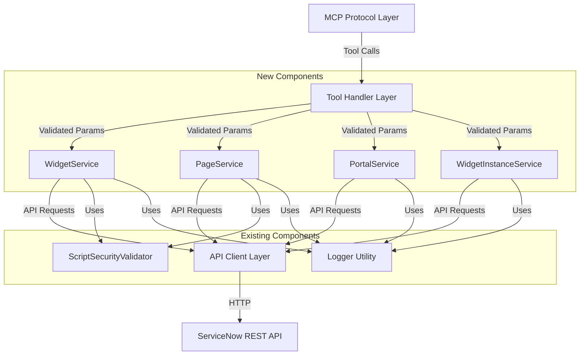
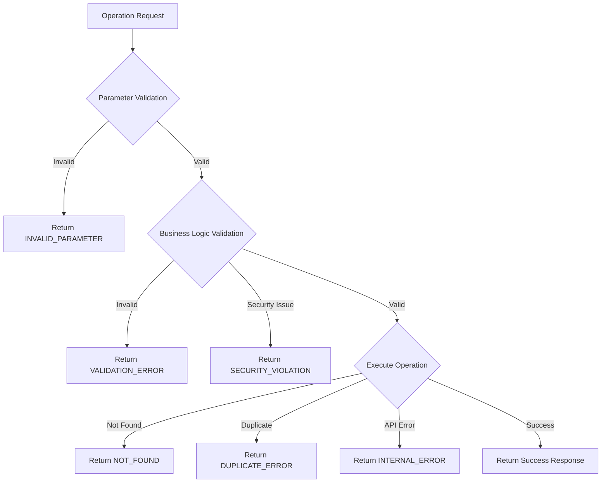

# Design Document: Service Portal Management

## Overview

This design implements Service Portal management capabilities for the ServiceNow MCP Server, enabling AI assistants to query, retrieve, create, update, and manage Service Portal components including widgets, pages, portals, and widget instances. The implementation follows the established four-layer architecture pattern used throughout the codebase:

1. **MCP Protocol Layer** - Tool definitions and parameter schemas
2. **Tool Handler Layer** - Parameter validation and orchestration
3. **Service Layer** - Business logic and data transformation
4. **API Client Layer** - ServiceNow REST API communication

Service Portal is ServiceNow's Angular-based framework for building custom user interfaces. The design leverages existing components (ServiceNowClient, ScriptSecurityValidator, logger) and follows patterns established by IncidentService, UserService, and ScriptIncludeService. Service Portal components are stored across multiple tables (sp_widget, sp_page, sp_portal, sp_instance) that work together to create complete portal experiences.

### Key Design Decisions

- **Multi-Service Architecture**: Separate service classes for each entity type (Widget, Page, Portal, WidgetInstance) to maintain clear separation of concerns
- **Security-First Validation**: All HTML, CSS, and JavaScript code is validated before creation/update using extended ScriptSecurityValidator with Service Portal-specific patterns
- **Flexible Identification**: Widgets and pages can be retrieved by sys_id or id (unique identifier) for developer convenience
- **JSON Schema Validation**: Demo data and widget options are validated as proper JSON before storage
- **Comprehensive Widget Management**: Support for cloning widgets, managing dependencies, and understanding widget usage across pages
- **Consistent Error Handling**: Uses standardized error codes and structured responses across all operations

## Architecture

### Component Diagram



### Layer Responsibilities

**MCP Protocol Layer**
- Defines 20+ tool schemas covering widgets, pages, portals, and widget instances
- Widget tools: query_widgets, get_widget, list_recent_widgets, create_widget, update_widget, clone_widget, validate_widget, get_widget_dependencies, get_pages_using_widget
- Page tools: query_pages, get_page, list_recent_pages, create_page, update_page, get_widgets_by_page
- Portal tools: query_portals, get_portal, list_portals
- Widget instance tools: query_widget_instances, get_widget_instance
- Specifies parameter types and descriptions using JSON Schema
- Registers tools with the MCP server

**Tool Handler Layer**
- Validates parameter types and constraints
- Enforces business rules (e.g., limit ranges, required fields, JSON validity)
- Orchestrates service layer calls
- Transforms service responses to tool response format
- Handles errors and returns structured error responses

**Service Layer**
- **WidgetService**: Implements business logic for widget operations, validates HTML/CSS/JavaScript code, manages widget dependencies
- **PageService**: Implements business logic for page operations, validates page structure and role assignments
- **PortalService**: Implements business logic for portal operations, manages portal configurations
- **WidgetInstanceService**: Implements business logic for widget instance operations, manages widget placement and configuration
- All services: Build ServiceNow encoded queries from filters, transform ServiceNow records to typed objects, log operations with timing information

**API Client Layer (ServiceNowClient)**
- Executes HTTP requests to ServiceNow Table API
- Handles authentication and connection management
- Provides generic CRUD methods (get, getById, post, put, delete)
- Manages error responses from ServiceNow

## Components and Interfaces

### WidgetService

The core service class for widget management.

```typescript
class WidgetService {
  private client: ServiceNowClient;
  private securityValidator: ScriptSecurityValidator;

  constructor(client: ServiceNowClient);

  // CRUD Operations
  async createWidget(data: CreateWidgetData): Promise<string>;
  async getWidget(identifier: string): Promise<WidgetDetail | null>;
  async updateWidget(sysId: string, updates: UpdateWidgetData): Promise<string>;
  async cloneWidget(sourceSysId: string, newId: string, newName: string): Promise<string>;

  // Query Operations
  async queryWidgets(filters: WidgetFilters): Promise<WidgetSummary[]>;
  async listRecentWidgets(limit: number): Promise<WidgetSummary[]>;

  // Validation and Dependencies
  async validateWidget(data: ValidateWidgetData): Promise<WidgetValidationResult>;
  async validateOptionSchema(schema: string): Promise<JSONValidationResult>;
  async validateLinkFunction(linkFunction: string): Promise<ValidationResult>;
  async validateSCSS(scss: string): Promise<ValidationResult>;
  async getWidgetDependencies(sysId: string): Promise<WidgetDependency[]>;
  async getPagesUsingWidget(sysId: string): Promise<PageSummary[]>;

  // Private Helper Methods
  private validateHTML(html: string): void;
  private validateCSS(css: string): void;
  private validateJavaScript(script: string): void;
  private validateJSON(json: string): void;
  private validateServerScriptAPIs(script: string): ValidationMessage[];
  private validateClientScriptAPIs(script: string): ValidationMessage[];
  private validateAngularDirectives(html: string): ValidationMessage[];
  private validateBootstrapClasses(html: string): ValidationMessage[];
  private validateEmbeddedWidgets(html: string): ValidationMessage[];
  private checkPerformancePatterns(html: string, clientScript: string): ValidationMessage[];
  private buildQuery(filters: WidgetFilters): string;
  private toWidgetSummary(record: ServiceNowRecord): WidgetSummary;
  private toWidgetDetail(record: ServiceNowRecord): WidgetDetail;
}
```

### PageService

The core service class for page management.

```typescript
class PageService {
  private client: ServiceNowClient;

  constructor(client: ServiceNowClient);

  // CRUD Operations
  async createPage(data: CreatePageData): Promise<string>;
  async getPage(identifier: string): Promise<PageDetail | null>;
  async updatePage(sysId: string, updates: UpdatePageData): Promise<string>;

  // Query Operations
  async queryPages(filters: PageFilters): Promise<PageSummary[]>;
  async listRecentPages(limit: number): Promise<PageSummary[]>;

  // Widget Relationships
  async getWidgetsByPage(pageSysId: string): Promise<WidgetOnPage[]>;

  // Private Helper Methods
  private validatePortalExists(portalSysId: string): Promise<boolean>;
  private validateRolesExist(roleSysIds: string[]): Promise<boolean>;
  private buildQuery(filters: PageFilters): string;
  private toPageSummary(record: ServiceNowRecord): PageSummary;
  private toPageDetail(record: ServiceNowRecord): PageDetail;
}
```

### PortalService

The core service class for portal management.

```typescript
class PortalService {
  private client: ServiceNowClient;

  constructor(client: ServiceNowClient);

  // Query and Retrieval Operations
  async queryPortals(filters: PortalFilters): Promise<PortalSummary[]>;
  async getPortal(identifier: string): Promise<PortalDetail | null>;
  async listPortals(limit: number): Promise<PortalSummary[]>;

  // Private Helper Methods
  private buildQuery(filters: PortalFilters): string;
  private toPortalSummary(record: ServiceNowRecord): PortalSummary;
  private toPortalDetail(record: ServiceNowRecord): PortalDetail;
}
```

### WidgetInstanceService

The core service class for widget instance management.

```typescript
class WidgetInstanceService {
  private client: ServiceNowClient;

  constructor(client: ServiceNowClient);

  // Query and Retrieval Operations
  async queryWidgetInstances(filters: WidgetInstanceFilters): Promise<WidgetInstanceSummary[]>;
  async getWidgetInstance(sysId: string): Promise<WidgetInstanceDetail | null>;

  // Private Helper Methods
  private buildQuery(filters: WidgetInstanceFilters): string;
  private toWidgetInstanceSummary(record: ServiceNowRecord): WidgetInstanceSummary;
  private toWidgetInstanceDetail(record: ServiceNowRecord): WidgetInstanceDetail;
}
```

### Security Validation

The existing ScriptSecurityValidator will be extended with Service Portal-specific patterns:

```typescript
// HTML blacklisted patterns
const HTML_BLACKLIST = [
  /on\w+\s*=/i,                      // Inline event handlers (onclick, onerror, etc.)
  /javascript:/i,                    // javascript: URLs
  /<script[^>]*>/i,                  // Script tags in unsafe contexts
  /{{.*constructor.*}}/i,            // Angular constructor access
  /{{.*__proto__.*}}/i,              // Prototype pollution
  /{{.*prototype.*}}/i,              // Prototype access
];

// CSS/SCSS blacklisted patterns
const CSS_BLACKLIST = [
  /expression\s*\(/i,                // IE expression()
  /behavior\s*:/i,                   // IE behavior
  /-moz-binding\s*:/i,               // Firefox binding
  /url\s*\(\s*javascript:/i,         // javascript: in url()
  /@import\s+/i,                     // @import (potential security risk)
];

// JavaScript blacklisted patterns (same as Script Includes)
const JS_BLACKLIST = [
  /eval\s*\(/i,                      // Arbitrary code execution
  /new\s+Function\s*\(/i,            // Dynamic function creation
  /require\s*\(/i,                   // Module loading
  /import\s+/i,                      // ES6 imports
  /document\.write\s*\(/i,           // DOM manipulation
  /\.innerHTML\s*=/i,                // XSS vector
  /\$window\.location\.href/i,       // Direct navigation (use $location.search)
];

// Discouraged patterns (warnings, not errors)
const DISCOURAGED_PATTERNS = [
  {
    pattern: /new\s+GlideRecord\s*\(/i,
    message: 'Use $sp.getRecord() or GlideQuery instead of GlideRecord in Service Portal',
    context: 'server_script'
  },
  {
    pattern: /\$scope\.\$apply\s*\(/i,
    message: 'Manual $scope.$apply() calls are usually unnecessary and can cause digest cycle issues',
    context: 'client_script'
  },
  {
    pattern: /\$scope\.\$watch\s*\(/i,
    message: 'Excessive use of $scope.$watch() can impact performance. Consider using one-time bindings (::) where possible',
    context: 'client_script'
  },
  {
    pattern: /{{[^:][^}]*}}/g,
    message: 'Consider using one-time binding ({{::variable}}) for static data to improve performance',
    context: 'html'
  },
  {
    pattern: /ng-bind-html/i,
    message: 'Ensure ng-bind-html content is properly sanitized to prevent XSS attacks',
    context: 'html'
  }
];

// ServiceNow API patterns (valid, should not be flagged)
const VALID_SP_API_PATTERNS = [
  /\$sp\.getRecord\s*\(/i,
  /\$sp\.getParameter\s*\(/i,
  /\$sp\.getWidget\s*\(/i,
  /\$sp\.getMenuHREF\s*\(/i,
  /\$sp\.getDisplayValue\s*\(/i,
  /\$sp\.getStream\s*\(/i,
  /\$sp\.getValues\s*\(/i,
  /\$sp\.getListColumns\s*\(/i,
  /\$sp\.getForm\s*\(/i,
  /\$sp\.getCatalogItem\s*\(/i,
  /\$sp\.getPortal\s*\(/i,
  /spUtil\.recordWatch\s*\(/i,
  /spUtil\.update\s*\(/i,
  /spUtil\.get\s*\(/i,
  /spUtil\.addTrivialMessage\s*\(/i,
  /spUtil\.addInfoMessage\s*\(/i,
  /spUtil\.addErrorMessage\s*\(/i,
  /c\.server\.get\s*\(/i,
  /c\.server\.update\s*\(/i,
  /this\.server\.get\s*\(/i,
  /this\.server\.update\s*\(/i
];

// Bootstrap 3.3.7 classes (valid, should not be flagged)
const VALID_BOOTSTRAP_CLASSES = [
  'container', 'container-fluid', 'row', 'col-xs-', 'col-sm-', 'col-md-', 'col-lg-',
  'panel', 'panel-default', 'panel-primary', 'panel-success', 'panel-info', 'panel-warning', 'panel-danger',
  'btn', 'btn-default', 'btn-primary', 'btn-success', 'btn-info', 'btn-warning', 'btn-danger',
  'form-control', 'form-group', 'input-group', 'alert', 'modal', 'nav', 'navbar', 'dropdown'
];

// AngularJS directives (valid, should not be flagged)
const VALID_ANGULAR_DIRECTIVES = [
  'ng-if', 'ng-repeat', 'ng-model', 'ng-click', 'ng-show', 'ng-hide', 'ng-class', 'ng-style',
  'ng-bind', 'ng-bind-html', 'ng-submit', 'ng-change', 'ng-blur', 'ng-focus', 'ng-disabled',
  'ng-readonly', 'ng-checked', 'ng-selected', 'ng-href', 'ng-src', 'ng-include'
];

// SCSS-specific patterns (valid, should not be flagged)
const VALID_SCSS_PATTERNS = [
  /\$[a-zA-Z_][a-zA-Z0-9_-]*/,      // SCSS variables
  /@mixin\s+[a-zA-Z_]/,              // SCSS mixins
  /@include\s+[a-zA-Z_]/,            // SCSS includes
  /@extend\s+/,                      // SCSS extends
  /&\s*:/,                           // SCSS parent selector
  /&\s*\./,                          // SCSS parent selector with class
];
```

### JSON Validation

Widget demo_data and widget instance options must be valid JSON:

```typescript
interface JSONValidation {
  validateJSON(jsonString: string): JSONValidationResult;
  parseJSON(jsonString: string): any;
}

interface JSONValidationResult {
  valid: boolean;
  error?: string;
  parsed?: any;
}

// Validation logic:
// - Attempt to parse with JSON.parse()
// - Catch and return detailed error message
// - Validate against reasonable size limits
```

## Data Models

### TypeScript Types

```typescript
/**
 * Summary view of a Widget (used in query/list operations)
 */
interface WidgetSummary {
  sys_id: string;
  name: string;
  id: string;
  public: boolean;
  category: string | null;
  data_table: string | null;
  sys_updated_on: string;
}

/**
 * Detailed view of a Widget (used in get operations)
 */
interface WidgetDetail extends WidgetSummary {
  html: string | null;
  css: string | null;
  client_script: string | null;
  server_script: string | null;
  link: string | null;
  option_schema: any | null;
  demo_data: any | null;
  description: string | null;
  dependencies: string[];
  sys_created_on: string;
}

/**
 * Filter parameters for querying Widgets
 */
interface WidgetFilters {
  name?: string;              // Partial match, case-insensitive
  id?: string;                // Exact match
  public?: boolean;           // Filter by public status
  category?: string;          // Filter by category sys_id
  data_table?: string;        // Filter by associated table
  query?: string;             // Custom encoded query
  limit?: number;             // Max results (1-100, default 25)
}

/**
 * Data for creating a Widget
 */
interface CreateWidgetData {
  name: string;
  id: string;
  html?: string;
  css?: string;
  client_script?: string;
  server_script?: string;
  link?: string;
  option_schema?: string;         // JSON string
  data_table?: string;
  demo_data?: string;              // JSON string
  public?: boolean;
  category?: string;
  description?: string;
}

/**
 * Data for updating a Widget
 */
interface UpdateWidgetData {
  name?: string;
  id?: string;
  html?: string;
  css?: string;
  client_script?: string;
  server_script?: string;
  link?: string;
  option_schema?: string;          // JSON string
  data_table?: string;
  demo_data?: string;              // JSON string
  public?: boolean;
  category?: string;
  description?: string;
}

/**
 * Data for validating a Widget
 */
interface ValidateWidgetData {
  html?: string;
  css?: string;
  client_script?: string;
  server_script?: string;
  link?: string;
  option_schema?: string;
  demo_data?: string;
}

/**
 * Widget validation result
 */
interface WidgetValidationResult {
  valid: boolean;
  warnings: ValidationMessage[];
  errors: ValidationMessage[];
}

interface ValidationMessage {
  type: string;
  field: string;
  message: string;
  detail: string;
}

/**
 * Widget dependency information
 */
interface WidgetDependency {
  sys_id: string;
  name: string;
  type: string;
  source: string;
}

/**
 * Summary view of a Page (used in query/list operations)
 */
interface PageSummary {
  sys_id: string;
  title: string;
  id: string;
  public: boolean;
  portal: string | null;
  roles: string[];
  sys_updated_on: string;
}

/**
 * Detailed view of a Page (used in get operations)
 */
interface PageDetail extends PageSummary {
  description: string | null;
  sys_created_on: string;
}

/**
 * Filter parameters for querying Pages
 */
interface PageFilters {
  title?: string;             // Partial match, case-insensitive
  id?: string;                // Exact match
  public?: boolean;           // Filter by public status
  portal?: string;            // Filter by portal sys_id
  query?: string;             // Custom encoded query
  limit?: number;             // Max results (1-100, default 25)
}

/**
 * Data for creating a Page
 */
interface CreatePageData {
  title: string;
  id: string;
  public?: boolean;
  portal?: string;
  roles?: string[];
  description?: string;
}

/**
 * Data for updating a Page
 */
interface UpdatePageData {
  title?: string;
  id?: string;
  public?: boolean;
  portal?: string;
  roles?: string[];
  description?: string;
}

/**
 * Widget on a page with configuration
 */
interface WidgetOnPage {
  sys_id: string;
  widget_sys_id: string;
  widget_name: string;
  widget_id: string;
  order: number;
  size: number;
  color: string | null;
  options: any | null;
}

/**
 * Summary view of a Portal (used in query/list operations)
 */
interface PortalSummary {
  sys_id: string;
  title: string;
  url_suffix: string;
  homepage: string | null;
  theme: string | null;
  sys_updated_on: string;
}

/**
 * Detailed view of a Portal (used in get operations)
 */
interface PortalDetail extends PortalSummary {
  logo: string | null;
  quick_start_config: string | null;
  sys_created_on: string;
}

/**
 * Filter parameters for querying Portals
 */
interface PortalFilters {
  title?: string;             // Partial match, case-insensitive
  url_suffix?: string;        // Exact match
  query?: string;             // Custom encoded query
  limit?: number;             // Max results (1-100, default 25)
}

/**
 * Summary view of a Widget Instance (used in query/list operations)
 */
interface WidgetInstanceSummary {
  sys_id: string;
  widget: string;
  page: string;
  order: number;
  color: string | null;
  size: number;
  options: any | null;
  sys_updated_on: string;
}

/**
 * Detailed view of a Widget Instance (used in get operations)
 */
interface WidgetInstanceDetail extends WidgetInstanceSummary {
  bootstrap_alt_text: string | null;
  sys_created_on: string;
}

/**
 * Filter parameters for querying Widget Instances
 */
interface WidgetInstanceFilters {
  page?: string;              // Filter by page sys_id
  widget?: string;            // Filter by widget sys_id
  query?: string;             // Custom encoded query
  limit?: number;             // Max results (1-100, default 25)
}
```

### ServiceNow Table Mappings

**sp_widget Table:**

| ServiceNow Field | TypeScript Field | Type | Notes |
|-----------------|------------------|------|-------|
| sys_id | sys_id | string | Unique identifier |
| name | name | string | Display name |
| id | id | string | Unique identifier for code |
| html | html | string \| null | HTML template with AngularJS directives |
| css | css | string \| null | CSS/SCSS styles (auto-scoped per widget) |
| client_script | client_script | string \| null | Angular controller (AngularJS 1.5.x) |
| server_script | server_script | string \| null | Server-side script with $sp API access |
| link | link | string \| null | AngularJS link function for DOM manipulation |
| option_schema | option_schema | any \| null | JSON schema for widget configuration |
| data_table | data_table | string \| null | Associated table (extends sp_instance) |
| demo_data | demo_data | any \| null | JSON demo data for testing |
| public | public | boolean | Public visibility |
| category | category | string \| null | Category sys_id |
| description | description | string \| null | Description |
| sys_created_on | sys_created_on | string | Creation timestamp |
| sys_updated_on | sys_updated_on | string | Update timestamp |

**sp_page Table:**

| ServiceNow Field | TypeScript Field | Type | Notes |
|-----------------|------------------|------|-------|
| sys_id | sys_id | string | Unique identifier |
| title | title | string | Page title |
| id | id | string | URL suffix |
| public | public | boolean | Public visibility |
| portal | portal | string \| null | Portal sys_id |
| roles | roles | string[] | Role sys_ids |
| description | description | string \| null | Description |
| sys_created_on | sys_created_on | string | Creation timestamp |
| sys_updated_on | sys_updated_on | string | Update timestamp |

**sp_portal Table:**

| ServiceNow Field | TypeScript Field | Type | Notes |
|-----------------|------------------|------|-------|
| sys_id | sys_id | string | Unique identifier |
| title | title | string | Portal title |
| url_suffix | url_suffix | string | URL prefix |
| homepage | homepage | string \| null | Homepage page sys_id |
| theme | theme | string \| null | Theme sys_id |
| logo | logo | string \| null | Logo attachment |
| quick_start_config | quick_start_config | string \| null | Configuration JSON |
| sys_created_on | sys_created_on | string | Creation timestamp |
| sys_updated_on | sys_updated_on | string | Update timestamp |

**sp_instance Table:**

| ServiceNow Field | TypeScript Field | Type | Notes |
|-----------------|------------------|------|-------|
| sys_id | sys_id | string | Unique identifier |
| widget | widget | string | Widget sys_id |
| page | page | string | Page sys_id |
| order | order | number | Position on page |
| color | color | string \| null | Visual styling |
| size | size | number | Column width |
| bootstrap_alt_text | bootstrap_alt_text | string \| null | Alt text |
| options | options | any \| null | JSON configuration |
| sys_created_on | sys_created_on | string | Creation timestamp |
| sys_updated_on | sys_updated_on | string | Update timestamp |


## Correctness Properties

A property is a characteristic or behavior that should hold true across all valid executions of a system—essentially, a formal statement about what the system should do. Properties serve as the bridge between human-readable specifications and machine-verifiable correctness guarantees.

### Widget Management Properties

**Property 1: Widget Create-Retrieve Round Trip**
*For any* valid widget data, creating a widget and then retrieving it by sys_id should return a widget with all the same field values.
**Validates: Requirements 2.1, 4.1**

**Property 2: Widget Create-Retrieve by ID Round Trip**
*For any* valid widget data, creating a widget and then retrieving it by id should return the same widget.
**Validates: Requirements 2.2, 4.1**

**Property 3: Widget Update Persistence**
*For any* existing widget and any valid update data, updating the widget and then retrieving it should reflect all the updated field values.
**Validates: Requirements 5.1, 5.10**

**Property 4: Widget Query Filter Conjunction**
*For any* query with multiple filters (name, id, public, category, data_table), only widgets matching ALL filter criteria should be returned.
**Validates: Requirements 1.1**

**Property 5: Widget Name Partial Match**
*For any* query with a name filter, widgets whose names contain the filter string (case-insensitive) should be returned.
**Validates: Requirements 1.2**

**Property 6: Widget ID Exact Match**
*For any* query with an id filter, only widgets with exactly matching id should be returned.
**Validates: Requirements 1.3**

**Property 7: Widget Boolean Filter Matching**
*For any* query with a public filter, only widgets with the exact boolean value should be returned.
**Validates: Requirements 1.4**

**Property 8: Widget Limit Validation and Capping**
*For any* query or list operation, if limit is provided it must be between 1 and 100, and if limit exceeds 100 it should be capped at 100.
**Validates: Requirements 1.8, 1.10, 3.2, 3.4**

**Property 9: Widget Summary Field Completeness**
*For any* query or list operation, each returned widget summary should contain sys_id, name, id, public, category, data_table, and sys_updated_on fields.
**Validates: Requirements 1.11, 3.5**

**Property 10: Widget Detail Field Completeness**
*For any* get operation on an existing widget, the returned detail should contain all summary fields plus html, css, client_script, server_script, demo_data, description, dependencies, and sys_created_on.
**Validates: Requirements 2.5**

**Property 11: Widget Recent Ordering**
*For any* list recent operation, the returned widgets should be ordered by sys_updated_on in descending order (most recent first).
**Validates: Requirements 3.1**

**Property 12: Widget Clone Field Preservation**
*For any* widget clone operation, all fields (html, css, client_script, server_script, data_table, demo_data, public, category, description, dependencies) should be copied from the source widget to the cloned widget.
**Validates: Requirements 6.1, 6.6**

**Property 13: Widget Clone Timestamp Update**
*For any* widget clone operation, the cloned widget's sys_created_on and sys_updated_on should be set to the current timestamp, not copied from the source.
**Validates: Requirements 6.7**

### Widget Validation Properties

**Property 14: Widget Required Fields Validation**
*For any* widget creation request missing name or id fields, the system should reject the request with an INVALID_PARAMETER error.
**Validates: Requirements 4.2, 4.3**

**Property 15: Widget HTML Security Validation**
*For any* HTML template containing dangerous patterns (inline event handlers, javascript: URLs, script tags, dangerous Angular expressions), the system should reject creation or update with a SECURITY_VIOLATION error.
**Validates: Requirements 4.4, 4.10, 5.2, 17.1, 17.8, 21.4, 21.5**

**Property 16: Widget CSS Security Validation**
*For any* CSS containing dangerous patterns (expression(), behavior, -moz-binding, url() with javascript:), the system should reject creation or update with a SECURITY_VIOLATION error.
**Validates: Requirements 4.5, 5.3, 17.2, 17.9, 21.6**

**Property 17: Widget JavaScript Security Validation**
*For any* JavaScript code (client_script or server_script) containing dangerous patterns (eval, Function constructor, require, import, document.write), the system should reject creation or update with a SECURITY_VIOLATION error.
**Validates: Requirements 4.6, 4.7, 5.4, 5.5, 17.3, 17.4, 17.10, 21.7**

**Property 18: Widget JSON Validation**
*For any* demo_data that is not valid JSON, the system should reject creation or update with a VALIDATION_ERROR.
**Validates: Requirements 4.8, 5.6, 26.1, 26.3**

**Property 19: Widget Duplicate ID Detection**
*For any* widget creation or clone request with an id that already exists, the system should return a DUPLICATE_ERROR.
**Validates: Requirements 4.9, 6.5**

**Property 20: Widget Not Found Handling**
*For any* get, update, or clone operation with a non-existent sys_id, the system should return a NOT_FOUND error or found: false.
**Validates: Requirements 2.3, 5.8, 6.4**

**Property 21: Widget Empty Update Rejection**
*For any* update request with no update fields provided, the system should reject the request with an INVALID_PARAMETER error.
**Validates: Requirements 5.9**

**Property 22: Widget Validation Result Structure**
*For any* widget validation request, the response should contain valid (boolean), warnings (array), and errors (array) fields.
**Validates: Requirements 17.5, 17.6, 17.7, 17.11**

### Page Management Properties

**Property 23: Page Create-Retrieve Round Trip**
*For any* valid page data, creating a page and then retrieving it by sys_id should return a page with all the same field values.
**Validates: Requirements 8.1, 10.1**

**Property 24: Page Create-Retrieve by ID Round Trip**
*For any* valid page data, creating a page and then retrieving it by id should return the same page.
**Validates: Requirements 8.2, 10.1**

**Property 25: Page Update Persistence**
*For any* existing page and any valid update data, updating the page and then retrieving it should reflect all the updated field values.
**Validates: Requirements 11.1, 11.7**

**Property 26: Page Query Filter Conjunction**
*For any* query with multiple filters (title, id, public, portal), only pages matching ALL filter criteria should be returned.
**Validates: Requirements 7.1**

**Property 27: Page Title Partial Match**
*For any* query with a title filter, pages whose titles contain the filter string (case-insensitive) should be returned.
**Validates: Requirements 7.2**

**Property 28: Page ID Exact Match**
*For any* query with an id filter, only pages with exactly matching id should be returned.
**Validates: Requirements 7.3**

**Property 29: Page Boolean Filter Matching**
*For any* query with a public filter, only pages with the exact boolean value should be returned.
**Validates: Requirements 7.4, 28.2, 28.3, 28.4**

**Property 30: Page Summary Field Completeness**
*For any* query or list operation, each returned page summary should contain sys_id, title, id, public, portal, roles, and sys_updated_on fields.
**Validates: Requirements 7.10, 9.5**

**Property 31: Page Detail Field Completeness**
*For any* get operation on an existing page, the returned detail should contain all summary fields plus description and sys_created_on.
**Validates: Requirements 8.5**

**Property 32: Page Recent Ordering**
*For any* list recent operation, the returned pages should be ordered by sys_updated_on in descending order (most recent first).
**Validates: Requirements 9.1**

**Property 33: Page Required Fields Validation**
*For any* page creation request missing title or id fields, the system should reject the request with an INVALID_PARAMETER error.
**Validates: Requirements 10.2, 10.3**

**Property 34: Page Duplicate ID Detection**
*For any* page creation request with an id that already exists, the system should return a DUPLICATE_ERROR.
**Validates: Requirements 10.4**

**Property 35: Page Portal Validation**
*For any* page creation or update with a portal reference, the portal must exist or the request should be rejected with a VALIDATION_ERROR.
**Validates: Requirements 10.5, 11.5, 29.1, 29.2**

**Property 36: Page Roles Validation**
*For any* page creation or update with roles, all role sys_ids must exist or the request should be rejected with a VALIDATION_ERROR.
**Validates: Requirements 10.6, 11.6, 29.1, 29.2**

### Portal Management Properties

**Property 37: Portal Query Filter Conjunction**
*For any* query with multiple filters (title, url_suffix), only portals matching ALL filter criteria should be returned.
**Validates: Requirements 12.1**

**Property 38: Portal Title Partial Match**
*For any* query with a title filter, portals whose titles contain the filter string (case-insensitive) should be returned.
**Validates: Requirements 12.2**

**Property 39: Portal URL Suffix Exact Match**
*For any* query with a url_suffix filter, only portals with exactly matching url_suffix should be returned.
**Validates: Requirements 12.3**

**Property 40: Portal Summary Field Completeness**
*For any* query or list operation, each returned portal summary should contain sys_id, title, url_suffix, homepage, theme, and sys_updated_on fields.
**Validates: Requirements 12.8, 14.5**

**Property 41: Portal Detail Field Completeness**
*For any* get operation on an existing portal, the returned detail should contain all summary fields plus logo, quick_start_config, and sys_created_on.
**Validates: Requirements 13.5**

**Property 42: Portal Not Found Handling**
*For any* get operation with a non-existent identifier, the system should return found: false.
**Validates: Requirements 13.3**

### Widget Instance Properties

**Property 43: Widget Instance Query Filter Conjunction**
*For any* query with multiple filters (page, widget), only widget instances matching ALL filter criteria should be returned.
**Validates: Requirements 15.1**

**Property 44: Widget Instance Page Filter Matching**
*For any* query with a page filter, only widget instances on the specified page should be returned.
**Validates: Requirements 15.2**

**Property 45: Widget Instance Widget Filter Matching**
*For any* query with a widget filter, only instances of the specified widget should be returned.
**Validates: Requirements 15.3**

**Property 46: Widget Instance Summary Field Completeness**
*For any* query operation, each returned widget instance summary should contain sys_id, widget, page, order, color, size, options, and sys_updated_on fields.
**Validates: Requirements 15.8**

**Property 47: Widget Instance Detail Field Completeness**
*For any* get operation on an existing widget instance, the returned detail should contain all summary fields plus bootstrap_alt_text and sys_created_on.
**Validates: Requirements 16.4**

**Property 48: Widget Instance Options JSON Parsing**
*For any* widget instance with options, the options should be returned as parsed JSON objects.
**Validates: Requirements 16.5, 26.5**

**Property 49: Widget Instance Ordering**
*For any* page, widget instances should be ordered by their order field when returned.
**Validates: Requirements 19.5, 30.1**

### Cross-Entity Relationship Properties

**Property 50: Widget Dependencies Retrieval**
*For any* widget with dependencies, retrieving the widget should include the list of dependency sys_ids.
**Validates: Requirements 2.6, 18.1, 18.4, 18.5**

**Property 51: Widgets by Page Retrieval**
*For any* page, retrieving widgets by page should return all widgets used on that page with their configuration.
**Validates: Requirements 19.1, 19.4, 19.5**

**Property 52: Pages Using Widget Retrieval**
*For any* widget, retrieving pages using the widget should return all pages that contain instances of that widget.
**Validates: Requirements 20.1, 20.4, 20.5**

**Property 53: Widget Data Table Validation**
*For any* widget creation with a data_table, the table must exist in ServiceNow or the request should be rejected with a VALIDATION_ERROR.
**Validates: Requirements 24.1, 40.1, 40.4**

**Property 54: Widget Category Validation**
*For any* widget creation with a category, the category must exist in ServiceNow or the request should be rejected with a VALIDATION_ERROR.
**Validates: Requirements 25.1**

### New Requirements Properties (31-40)

**Property 57: Widget Option Schema JSON Validation**
*For any* widget creation or update with an option_schema, the option_schema must be valid JSON or the request should be rejected with a VALIDATION_ERROR.
**Validates: Requirements 31.1, 31.5**

**Property 58: Widget Option Schema Field Completeness**
*For any* widget with an option_schema, retrieving the widget should include the option_schema field as parsed JSON.
**Validates: Requirements 31.2**

**Property 59: Widget Link Function Security Validation**
*For any* link function containing dangerous patterns (eval, Function constructor, document.write), the system should reject creation or update with a SECURITY_VIOLATION error.
**Validates: Requirements 32.1, 32.3**

**Property 60: Widget Link Function Signature Validation**
*For any* link function, it should follow the AngularJS link function signature pattern: function(scope, element, attrs, controller).
**Validates: Requirements 32.4**

**Property 61: Widget SCSS Syntax Validation**
*For any* CSS field containing SCSS syntax, the system should validate SCSS compilation and reject invalid SCSS with a VALIDATION_ERROR.
**Validates: Requirements 33.2**

**Property 62: Widget SCSS Variable Recognition**
*For any* CSS field containing SCSS variables (e.g., $primary-color), the system should recognize them as valid and not flag as errors.
**Validates: Requirements 33.5**

**Property 63: Widget Server Script $sp API Validation**
*For any* server script, the system should recognize valid $sp API methods and not flag them as errors.
**Validates: Requirements 34.1, 34.2**

**Property 64: Widget Client Script spUtil Validation**
*For any* client script, the system should recognize valid spUtil methods and proper dependency injection patterns.
**Validates: Requirements 35.1, 35.2**

**Property 65: Widget One-Time Binding Recommendation**
*For any* HTML template with static data bindings, the system should recommend using one-time binding syntax ({{::variable}}).
**Validates: Requirements 36.1**

**Property 66: Widget Performance Pattern Detection**
*For any* client script using $scope.$watch() excessively, the system should warn about performance implications.
**Validates: Requirements 36.2**

**Property 67: Widget Bootstrap Class Recognition**
*For any* HTML template using Bootstrap 3.3.7 classes, the system should recognize them as valid and not flag as errors.
**Validates: Requirements 37.1, 37.4**

**Property 68: Widget AngularJS Directive Recognition**
*For any* HTML template using standard AngularJS directives, the system should recognize them as valid and not flag as errors.
**Validates: Requirements 38.1, 38.4**

**Property 69: Widget ng-bind-html Sanitization Warning**
*For any* HTML template using ng-bind-html without proper sanitization, the system should warn about XSS risks.
**Validates: Requirements 38.5**

**Property 70: Widget Embedded Widget Syntax Validation**
*For any* HTML template using <widget> tag syntax, the system should validate proper options passing and widget existence.
**Validates: Requirements 39.1, 39.2, 39.3**

**Property 71: Widget Data Table Extension Validation**
*For any* widget with a data_table, the system should validate that the table extends sp_instance.
**Validates: Requirements 40.1, 40.2**

### Error Handling Properties

**Property 55: Structured Error Response**
*For any* operation that fails, the error response should contain code, message, and detail fields.
**Validates: Requirements 22.1, 22.2**

**Property 56: Standardized Error Codes**
*For any* error response, the error code should be one of: INVALID_PARAMETER, VALIDATION_ERROR, SECURITY_VIOLATION, NOT_FOUND, DUPLICATE_ERROR, or INTERNAL_ERROR.
**Validates: Requirements 22.2**

## Error Handling

### Error Code Taxonomy

The system uses a standardized set of error codes across all operations:

| Error Code | Usage | HTTP Equivalent |
|-----------|-------|-----------------|
| INVALID_PARAMETER | Parameter type mismatch, missing required parameter, out of range value | 400 Bad Request |
| VALIDATION_ERROR | Business rule violation, invalid reference, pattern mismatch | 400 Bad Request |
| SECURITY_VIOLATION | Dangerous code pattern detected, blacklisted operation | 403 Forbidden |
| NOT_FOUND | Entity does not exist | 404 Not Found |
| DUPLICATE_ERROR | Entity with same unique identifier already exists | 409 Conflict |
| INTERNAL_ERROR | Unexpected system error, ServiceNow API failure | 500 Internal Server Error |

### Error Response Structure

All errors follow a consistent structure:

```typescript
interface ErrorResponse {
  error: {
    code: string;           // One of the standardized error codes
    message: string;        // Human-readable error message
    detail?: string;        // Additional context or technical details
  }
}
```

### Error Handling Flow



### Logging Strategy

All operations are logged with the following information:

**Operation Start:**
- Operation name
- Input parameters (sanitized, no sensitive data)
- Timestamp

**Operation Success:**
- Operation name
- Result summary (count, sys_id, etc.)
- Duration in milliseconds

**Operation Failure:**
- Operation name
- Error code and message
- Error details
- Duration in milliseconds

**Security Violations:**
- Operation name
- Detected pattern
- Code excerpt (first 100 characters)
- User context (if available)
- Timestamp

## Testing Strategy

### Dual Testing Approach

The testing strategy employs both unit tests and property-based tests to ensure comprehensive coverage:

**Unit Tests:**
- Specific examples demonstrating correct behavior
- Edge cases (empty strings, boundary values, special characters)
- Error conditions (not found, duplicate, invalid input)
- Integration points between components
- Mock ServiceNow API responses for error scenarios

**Property-Based Tests:**
- Universal properties that hold for all inputs
- Comprehensive input coverage through randomization
- Minimum 100 iterations per property test
- Each test references its design document property

### Property-Based Testing Configuration

The implementation will use **fast-check** (JavaScript/TypeScript property-based testing library) with the following configuration:

```typescript
import fc from 'fast-check';

// Minimum 100 iterations per property test
const propertyTestConfig = {
  numRuns: 100,
  verbose: true
};

// Example property test structure
describe('Property 1: Widget Create-Retrieve Round Trip', () => {
  it('should preserve all fields when creating and retrieving a widget', async () => {
    await fc.assert(
      fc.asyncProperty(
        widgetArbitrary(),
        async (widgetData) => {
          // Feature: service-portal-management, Property 1: Widget Create-Retrieve Round Trip
          const sysId = await widgetService.createWidget(widgetData);
          const retrieved = await widgetService.getWidget(sysId);
          
          expect(retrieved).not.toBeNull();
          expect(retrieved!.name).toBe(widgetData.name);
          expect(retrieved!.id).toBe(widgetData.id);
          expect(retrieved!.html).toBe(widgetData.html);
          // ... verify all fields
        }
      ),
      propertyTestConfig
    );
  });
});
```

### Test Data Generators

Property-based tests require generators (arbitraries) for creating random test data:

```typescript
// Generator for valid widget names
const widgetNameArbitrary = () =>
  fc.string({ minLength: 1, maxLength: 100 })
    .filter(s => s.trim().length > 0);

// Generator for valid widget IDs
const widgetIdArbitrary = () =>
  fc.string({ minLength: 1, maxLength: 100 })
    .filter(s => /^[a-zA-Z_][a-zA-Z0-9_-]*$/.test(s));

// Generator for safe HTML
const safeHTMLArbitrary = () =>
  fc.constantFrom(
    '<div>{{c.data.message}}</div>',
    '<h1>{{c.options.title}}</h1>',
    '<ul><li ng-repeat="item in c.data.items">{{item.name}}</li></ul>'
  );

// Generator for dangerous HTML patterns
const dangerousHTMLArbitrary = () =>
  fc.constantFrom(
    '<div onclick="alert(1)">Click</div>',
    '<a href="javascript:alert(1)">Link</a>',
    '<div>{{constructor.constructor("alert(1)")()}}</div>',
    '<script>alert(1)</script>'
  );

// Generator for safe CSS
const safeCSSArbitrary = () =>
  fc.constantFrom(
    '.widget { color: red; }',
    '.container { display: flex; }',
    'h1 { font-size: 24px; }'
  );

// Generator for dangerous CSS patterns
const dangerousCSSArbitrary = () =>
  fc.constantFrom(
    '.widget { behavior: url(xss.htc); }',
    '.widget { -moz-binding: url(xss.xml); }',
    '.widget { background: url(javascript:alert(1)); }',
    '.widget { width: expression(alert(1)); }'
  );

// Generator for safe JavaScript
const safeJavaScriptArbitrary = () =>
  fc.constantFrom(
    'function() { c.data.message = "Hello"; }',
    'function() { var dt = new GlideDateTime(); return dt.getDisplayValue(); }',
    'function() { gs.info("Widget loaded"); }'
  );

// Generator for dangerous JavaScript patterns
const dangerousJavaScriptArbitrary = () =>
  fc.constantFrom(
    'eval("alert(1)")',
    'new Function("return alert(1)")()',
    'require("fs")',
    'document.write("<script>alert(1)</script>")'
  );

// Generator for valid JSON
const validJSONArbitrary = () =>
  fc.oneof(
    fc.constant('{"key": "value"}'),
    fc.constant('[1, 2, 3]'),
    fc.constant('{"nested": {"data": true}}')
  );

// Generator for invalid JSON
const invalidJSONArbitrary = () =>
  fc.constantFrom(
    '{key: value}',
    '[1, 2, 3,]',
    '{"unclosed": '
  );

// Generator for complete widget data
const widgetArbitrary = () =>
  fc.record({
    name: widgetNameArbitrary(),
    id: widgetIdArbitrary(),
    html: fc.option(safeHTMLArbitrary(), { nil: null }),
    css: fc.option(safeCSSArbitrary(), { nil: null }),
    client_script: fc.option(safeJavaScriptArbitrary(), { nil: null }),
    server_script: fc.option(safeJavaScriptArbitrary(), { nil: null }),
    data_table: fc.option(fc.constantFrom('incident', 'task', 'sys_user'), { nil: null }),
    demo_data: fc.option(validJSONArbitrary(), { nil: null }),
    public: fc.boolean(),
    category: fc.option(fc.hexaString({ minLength: 32, maxLength: 32 }), { nil: null }),
    description: fc.option(fc.string(), { nil: null })
  });

// Generator for page data
const pageArbitrary = () =>
  fc.record({
    title: fc.string({ minLength: 1, maxLength: 100 }),
    id: fc.string({ minLength: 1, maxLength: 100 })
      .filter(s => /^[a-zA-Z_][a-zA-Z0-9_-]*$/.test(s)),
    public: fc.boolean(),
    portal: fc.option(fc.hexaString({ minLength: 32, maxLength: 32 }), { nil: null }),
    roles: fc.array(fc.hexaString({ minLength: 32, maxLength: 32 })),
    description: fc.option(fc.string(), { nil: null })
  });
```

### Test Coverage Goals

- **Unit Test Coverage:** 90%+ line coverage for service and handler code
- **Property Test Coverage:** All 56 correctness properties implemented as property tests
- **Integration Test Coverage:** End-to-end tests for each tool with real ServiceNow API calls (in test environment)
- **Security Test Coverage:** All blacklisted patterns tested individually for HTML, CSS, and JavaScript
- **Error Path Coverage:** All error codes tested with appropriate triggers

### Test Organization

```
src/
  service/
    WidgetService.ts
    WidgetService.test.ts           # Unit tests
    WidgetService.property.test.ts  # Property-based tests
    PageService.ts
    PageService.test.ts
    PageService.property.test.ts
    PortalService.ts
    PortalService.test.ts
    PortalService.property.test.ts
    WidgetInstanceService.ts
    WidgetInstanceService.test.ts
    WidgetInstanceService.property.test.ts
  tools/
    widgetHandlers.ts
    widgetHandlers.test.ts
    pageHandlers.ts
    pageHandlers.test.ts
    portalHandlers.ts
    portalHandlers.test.ts
    widgetInstanceHandlers.ts
    widgetInstanceHandlers.test.ts
  types/
    widget.ts
    page.ts
    portal.ts
    widgetInstance.ts
```

### Testing Anti-Patterns to Avoid

- **Don't write too many unit tests for input variations** - Property tests handle this better
- **Don't test implementation details** - Test behavior, not internal structure
- **Don't mock excessively** - Use real ServiceNowClient with test instance when possible
- **Don't skip property tests** - They catch edge cases unit tests miss
- **Don't test the same thing twice** - If a property test covers it, unit test is redundant

### Example Test Cases

**Unit Test Example - Specific Edge Case:**
```typescript
describe('WidgetService.createWidget', () => {
  it('should reject creation when id already exists', async () => {
    // Create first widget
    await widgetService.createWidget({
      name: 'Test Widget',
      id: 'test-widget',
      html: '<div>Test</div>'
    });
    
    // Attempt to create duplicate
    await expect(
      widgetService.createWidget({
        name: 'Another Widget',
        id: 'test-widget',  // Same id
        html: '<div>Another</div>'
      })
    ).rejects.toMatchObject({
      code: 'DUPLICATE_ERROR'
    });
  });
});
```

**Property Test Example - Universal Behavior:**
```typescript
describe('Property 15: Widget HTML Security Validation', () => {
  it('should reject any HTML containing dangerous patterns', async () => {
    await fc.assert(
      fc.asyncProperty(
        widgetNameArbitrary(),
        widgetIdArbitrary(),
        dangerousHTMLArbitrary(),
        async (name, id, dangerousHTML) => {
          // Feature: service-portal-management, Property 15: Widget HTML Security Validation
          await expect(
            widgetService.createWidget({
              name,
              id,
              html: dangerousHTML
            })
          ).rejects.toMatchObject({
            code: 'SECURITY_VIOLATION'
          });
        }
      ),
      { numRuns: 100 }
    );
  });
});
```

**Property Test Example - Round Trip:**
```typescript
describe('Property 1: Widget Create-Retrieve Round Trip', () => {
  it('should preserve all fields when creating and retrieving a widget', async () => {
    await fc.assert(
      fc.asyncProperty(
        widgetArbitrary(),
        async (widgetData) => {
          // Feature: service-portal-management, Property 1: Widget Create-Retrieve Round Trip
          const sysId = await widgetService.createWidget(widgetData);
          const retrieved = await widgetService.getWidget(sysId);
          
          expect(retrieved).not.toBeNull();
          expect(retrieved!.name).toBe(widgetData.name);
          expect(retrieved!.id).toBe(widgetData.id);
          expect(retrieved!.html).toBe(widgetData.html);
          expect(retrieved!.css).toBe(widgetData.css);
          expect(retrieved!.client_script).toBe(widgetData.client_script);
          expect(retrieved!.server_script).toBe(widgetData.server_script);
          expect(retrieved!.data_table).toBe(widgetData.data_table);
          expect(retrieved!.public).toBe(widgetData.public);
          expect(retrieved!.category).toBe(widgetData.category);
          expect(retrieved!.description).toBe(widgetData.description);
        }
      ),
      { numRuns: 100 }
    );
  });
});
```
