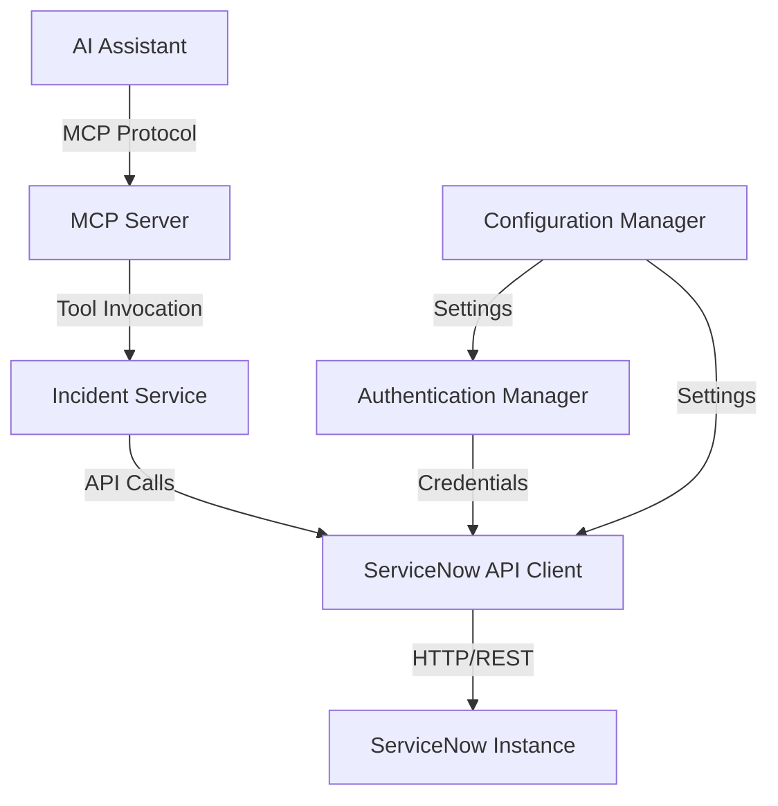
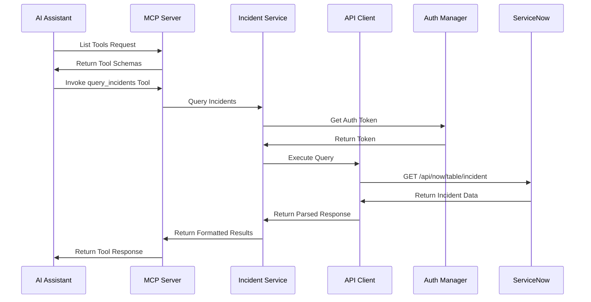

# Design Document: ServiceNow MCP Server

## Overview

The ServiceNow MCP Server is a TypeScript-based Model Context Protocol (MCP) server that provides AI assistants with read-only access to ServiceNow incident data. The server implements the MCP specification, exposing ServiceNow incident operations as discoverable tools with JSON Schema validation.

The architecture follows a layered approach:
- **MCP Protocol Layer**: Handles MCP protocol communication and tool registration
- **Service Layer**: Implements business logic for incident operations
- **API Client Layer**: Manages HTTP communication with ServiceNow REST APIs
- **Authentication Layer**: Handles credential management and session lifecycle

This design prioritizes simplicity and correctness, focusing exclusively on incident read operations to validate the approach before expanding to additional ServiceNow capabilities.

## Architecture

### High-Level Architecture



### Component Interaction Flow



## Components and Interfaces

### 1. MCP Server (Entry Point)

The main server component that implements the MCP protocol specification.

**Responsibilities:**
- Initialize and start the MCP server
- Register all available tools with JSON schemas
- Route tool invocations to appropriate service methods
- Handle MCP protocol messages (initialize, list_tools, call_tool)
- Validate tool parameters against schemas
- Format responses according to MCP specification

**Interface:**
```typescript
class MCPServer {
  constructor(config: ServerConfig)
  
  // Initialize server and register tools
  async start(): Promise<void>
  
  // Handle MCP protocol messages
  async handleRequest(request: MCPRequest): Promise<MCPResponse>
  
  // Register a tool with its schema
  registerTool(tool: ToolDefinition): void
  
  // Shutdown server gracefully
  async stop(): Promise<void>
}

interface ServerConfig {
  servicenowUrl: string
  username: string
  password: string
  logLevel?: 'debug' | 'info' | 'warn' | 'error'
}

interface ToolDefinition {
  name: string
  description: string
  inputSchema: JSONSchema
  handler: (params: unknown) => Promise<unknown>
}
```

### 2. Configuration Manager

Manages server configuration from environment variables and validates settings.

**Responsibilities:**
- Load configuration from environment variables
- Validate configuration values (URL format, required fields)
- Provide configuration to other components
- Test connectivity to ServiceNow instance

**Interface:**
```typescript
class ConfigurationManager {
  // Load and validate configuration
  static loadConfig(): ServerConfig
  
  // Validate ServiceNow URL format
  static validateUrl(url: string): boolean
  
  // Test connectivity to ServiceNow instance
  static async testConnectivity(config: ServerConfig): Promise<boolean>
}

// Environment variables:
// SERVICENOW_INSTANCE_URL - ServiceNow instance URL
// SERVICENOW_USERNAME - ServiceNow username
// SERVICENOW_PASSWORD - ServiceNow password
// LOG_LEVEL - Optional logging level
```

### 3. Authentication Manager

Handles ServiceNow authentication and session management.

**Responsibilities:**
- Validate credentials against ServiceNow
- Store and manage authentication tokens
- Detect session expiration
- Provide authentication headers for API requests

**Interface:**
```typescript
class AuthenticationManager {
  constructor(config: AuthConfig)
  
  // Validate credentials and establish session
  async authenticate(): Promise<AuthResult>
  
  // Get current authentication headers
  getAuthHeaders(): Record<string, string>
  
  // Check if session is valid
  isAuthenticated(): boolean
  
  // Handle session expiration
  handleExpiration(): void
}

interface AuthConfig {
  instanceUrl: string
  username: string
  password: string
}

interface AuthResult {
  success: boolean
  error?: string
}
```

### 4. ServiceNow API Client

Low-level HTTP client for ServiceNow REST API communication.

**Responsibilities:**
- Execute HTTP requests to ServiceNow REST APIs
- Handle request/response serialization
- Manage connection errors and retries
- Parse ServiceNow API responses
- Include authentication headers in requests

**Interface:**
```typescript
class ServiceNowClient {
  constructor(config: ClientConfig, authManager: AuthenticationManager)
  
  // Execute a GET request to ServiceNow Table API
  async get(table: string, params: QueryParams): Promise<ServiceNowResponse>
  
  // Execute a GET request for a specific record
  async getById(table: string, sysId: string): Promise<ServiceNowRecord>
  
  // Handle API errors and format error responses
  private handleError(error: unknown): ServiceNowError
}

interface ClientConfig {
  instanceUrl: string
  timeout?: number
  maxRetries?: number
}

interface QueryParams {
  sysparm_query?: string
  sysparm_limit?: number
  sysparm_offset?: number
  sysparm_fields?: string
  sysparm_display_value?: boolean
}

interface ServiceNowResponse {
  result: ServiceNowRecord[]
}

interface ServiceNowRecord {
  sys_id: string
  [key: string]: unknown
}

interface ServiceNowError {
  code: string
  message: string
  detail?: string
}
```

### 5. Incident Service

Business logic layer for incident operations.

**Responsibilities:**
- Implement incident query logic
- Build ServiceNow query strings from filter parameters
- Transform ServiceNow responses into tool response format
- Validate filter parameters
- Apply result limits and ordering

**Interface:**
```typescript
class IncidentService {
  constructor(client: ServiceNowClient)
  
  // Query incidents with filters
  async queryIncidents(filters: IncidentFilters): Promise<IncidentSummary[]>
  
  // Get a specific incident by sys_id or number
  async getIncident(identifier: string): Promise<IncidentDetail | null>
  
  // List recent incidents
  async listRecentIncidents(limit?: number): Promise<IncidentSummary[]>
  
  // Build ServiceNow query string from filters
  private buildQuery(filters: IncidentFilters): string
  
  // Transform ServiceNow record to incident summary
  private toIncidentSummary(record: ServiceNowRecord): IncidentSummary
  
  // Transform ServiceNow record to incident detail
  private toIncidentDetail(record: ServiceNowRecord): IncidentDetail
}

interface IncidentFilters {
  state?: string[]
  priority?: number[]
  assigned_to?: string
  assignment_group?: string
  query?: string
  limit?: number
}

interface IncidentSummary {
  sys_id: string
  number: string
  short_description: string
  state: string
  priority: number
  assigned_to: string | null
  updated_at: string
}

interface IncidentDetail extends IncidentSummary {
  description: string
  category: string | null
  opened_by: string
  opened_at: string
  resolution_notes: string | null
}
```

### 6. Tool Handlers

Individual tool implementations that bridge MCP tool invocations to service methods.

**Responsibilities:**
- Validate tool parameters
- Call appropriate service methods
- Format service responses for MCP protocol
- Handle errors and return structured error responses

**Tools:**

**Tool 1: query_incidents**
```typescript
async function queryIncidentsHandler(params: QueryIncidentsParams): Promise<QueryIncidentsResponse> {
  // Validate parameters
  // Call incidentService.queryIncidents()
  // Format and return results
}

interface QueryIncidentsParams {
  state?: string[]
  priority?: number[]
  assigned_to?: string
  assignment_group?: string
  query?: string
  limit?: number
}

interface QueryIncidentsResponse {
  incidents: IncidentSummary[]
  count: number
}
```

**Tool 2: get_incident**
```typescript
async function getIncidentHandler(params: GetIncidentParams): Promise<GetIncidentResponse> {
  // Validate identifier
  // Call incidentService.getIncident()
  // Return incident or error
}

interface GetIncidentParams {
  identifier: string  // sys_id or incident number
}

interface GetIncidentResponse {
  incident: IncidentDetail | null
  found: boolean
}
```

**Tool 3: list_recent_incidents**
```typescript
async function listRecentIncidentsHandler(params: ListRecentParams): Promise<ListRecentResponse> {
  // Validate limit
  // Call incidentService.listRecentIncidents()
  // Return results
}

interface ListRecentParams {
  limit?: number
}

interface ListRecentResponse {
  incidents: IncidentSummary[]
  count: number
}
```

## Data Models

### Incident States

ServiceNow incident states are represented as numeric values with string labels:

```typescript
enum IncidentState {
  New = 1,
  InProgress = 2,
  OnHold = 3,
  Resolved = 6,
  Closed = 7,
  Canceled = 8
}

const STATE_LABELS: Record<number, string> = {
  1: 'New',
  2: 'In Progress',
  3: 'On Hold',
  6: 'Resolved',
  7: 'Closed',
  8: 'Canceled'
}
```

### Priority Levels

```typescript
enum IncidentPriority {
  Critical = 1,
  High = 2,
  Moderate = 3,
  Low = 4,
  Planning = 5
}

const PRIORITY_LABELS: Record<number, string> = {
  1: 'Critical',
  2: 'High',
  3: 'Moderate',
  4: 'Low',
  5: 'Planning'
}
```

### ServiceNow Query Syntax

ServiceNow uses encoded query strings for filtering. The service builds these queries using the following operators:

- `=` - Equals
- `!=` - Not equals
- `LIKE` - Contains
- `STARTSWITH` - Starts with
- `>` - Greater than
- `<` - Less than
- `^` - AND operator
- `^OR` - OR operator

Example query: `state=1^priority=1^ORpriority=2`
(State is New AND (Priority is Critical OR Priority is High))

### JSON Schemas for Tools

**query_incidents schema:**
```json
{
  "type": "object",
  "properties": {
    "state": {
      "type": "array",
      "items": { "type": "string" },
      "description": "Filter by incident states (New, In Progress, On Hold, Resolved, Closed)"
    },
    "priority": {
      "type": "array",
      "items": { "type": "integer", "minimum": 1, "maximum": 5 },
      "description": "Filter by priority levels (1=Critical, 2=High, 3=Moderate, 4=Low, 5=Planning)"
    },
    "assigned_to": {
      "type": "string",
      "description": "Filter by assigned user (name or sys_id)"
    },
    "assignment_group": {
      "type": "string",
      "description": "Filter by assignment group (name or sys_id)"
    },
    "query": {
      "type": "string",
      "description": "Custom ServiceNow encoded query string"
    },
    "limit": {
      "type": "integer",
      "minimum": 1,
      "maximum": 100,
      "default": 25,
      "description": "Maximum number of results to return"
    }
  }
}
```

**get_incident schema:**
```json
{
  "type": "object",
  "properties": {
    "identifier": {
      "type": "string",
      "description": "Incident sys_id or incident number (e.g., INC0010001)"
    }
  },
  "required": ["identifier"]
}
```

**list_recent_incidents schema:**
```json
{
  "type": "object",
  "properties": {
    "limit": {
      "type": "integer",
      "minimum": 1,
      "maximum": 100,
      "default": 25,
      "description": "Maximum number of results to return"
    }
  }
}
```


## Correctness Properties

A property is a characteristic or behavior that should hold true across all valid executions of a system—essentially, a formal statement about what the system should do. Properties serve as the bridge between human-readable specifications and machine-verifiable correctness guarantees.

### Authentication Properties

**Property 1: Valid credentials establish authenticated sessions**
*For any* valid ServiceNow credentials, authenticating should result in a session with stored authentication tokens that can be used for subsequent API calls.
**Validates: Requirements 1.1, 1.2**

**Property 2: Invalid credentials produce descriptive errors**
*For any* invalid ServiceNow credentials, authentication attempts should fail and return a descriptive error message indicating why authentication failed.
**Validates: Requirements 1.3**

### Tool Registration Properties

**Property 3: All registered tools have valid JSON schemas**
*For any* tool registered with the MCP server, the tool should have a complete JSON schema definition that includes all required parameters and their types.
**Validates: Requirements 2.3**

**Property 4: Invalid tool parameters trigger validation errors**
*For any* tool invocation with parameters that don't match the tool's JSON schema, the server should return a schema validation error before attempting to execute the tool.
**Validates: Requirements 2.4**

### Query Properties

**Property 5: Query filters are correctly applied**
*For any* query with filter criteria (state, priority, assignment), all returned incidents should match the specified filter conditions.
**Validates: Requirements 3.1, 6.1, 7.1, 8.1, 8.2**

**Property 6: Query results contain required summary fields**
*For any* incident returned from a query or list operation, the result should include sys_id, number, short_description, state, priority, assigned_to, and updated_at fields.
**Validates: Requirements 3.2, 5.5**

**Property 7: Query operators work correctly**
*For any* supported query operator (equals, not equals, contains, starts with, greater than, less than), queries using that operator should return incidents that satisfy the operator's condition.
**Validates: Requirements 3.3**

**Property 8: Result limits are enforced**
*For any* query or list operation with a limit parameter, the number of returned incidents should not exceed the specified limit, and should never exceed 100 incidents.
**Validates: Requirements 3.4, 5.2**

**Property 9: Multiple filter values use OR logic**
*For any* query with multiple values for a single filter type (e.g., multiple states or priorities), the results should include incidents matching any of the specified values.
**Validates: Requirements 6.3, 7.3**

**Property 10: Filter input validation rejects invalid values**
*For any* query with invalid filter values (invalid state names, priority numbers outside 1-5, etc.), the server should return a validation error before executing the query.
**Validates: Requirements 6.4, 7.4**

**Property 11: Combined user and group filters use OR logic**
*For any* query with both assigned_to and assignment_group filters, the results should include incidents matching either the user assignment or the group assignment.
**Validates: Requirements 8.5**

**Property 12: Assignment filters support multiple identifier formats**
*For any* valid identifier format (user name, user sys_id, group name, group sys_id), assignment filtering should correctly resolve the identifier and return matching incidents.
**Validates: Requirements 8.4**

### Incident Retrieval Properties

**Property 13: Incidents can be retrieved by any valid identifier**
*For any* valid incident identifier (sys_id or incident number), retrieving the incident should return the complete incident record with all standard fields.
**Validates: Requirements 4.1, 4.2**

**Property 14: Retrieved incidents contain all detail fields**
*For any* incident retrieved by identifier, the result should include all standard fields: sys_id, number, short_description, description, state, priority, category, assigned_to, opened_by, opened_at, updated_at, and resolution_notes.
**Validates: Requirements 4.3**

**Property 15: Non-existent identifiers return not found errors**
*For any* identifier that doesn't correspond to an existing incident, the retrieval operation should return a not found error rather than an empty result or exception.
**Validates: Requirements 4.4**

**Property 16: All incident responses are valid JSON**
*For any* incident response (query, retrieval, or list), the response should be valid, parseable JSON with the expected structure.
**Validates: Requirements 4.5**

### List Operation Properties

**Property 17: List results are ordered by recency**
*For any* list operation, the returned incidents should be ordered by their updated_at timestamp in descending order (most recent first).
**Validates: Requirements 5.1, 5.4**

### Error Handling Properties

**Property 18: All errors return structured responses**
*For any* operation that fails (authentication, validation, API error, network error), the server should return a structured error response containing an error code, descriptive message, and relevant context.
**Validates: Requirements 9.1**

**Property 19: ServiceNow API errors are propagated with details**
*For any* error returned by the ServiceNow API, the MCP server's error response should include the ServiceNow error details (code, message, status) to aid in debugging.
**Validates: Requirements 9.2**

**Property 20: Success responses have consistent structure**
*For any* successful operation, the response should follow a consistent format with the operation result and relevant metadata (count, timestamps, etc.).
**Validates: Requirements 9.3**

### Configuration Properties

**Property 21: URL validation rejects malformed URLs**
*For any* configuration with an instance URL, the server should validate the URL format and reject malformed URLs before attempting to connect.
**Validates: Requirements 10.2**

## Error Handling

### Error Categories

The server implements comprehensive error handling across four categories:

1. **Authentication Errors**
   - Invalid credentials
   - Session expiration
   - Missing authentication configuration
   - HTTP 401/403 responses from ServiceNow

2. **Validation Errors**
   - Invalid tool parameters (schema validation failures)
   - Invalid filter values (state names, priority numbers)
   - Malformed identifiers
   - Invalid URL formats

3. **API Errors**
   - ServiceNow REST API errors (4xx, 5xx responses)
   - Network connectivity issues
   - Timeout errors
   - Rate limiting

4. **Not Found Errors**
   - Non-existent incident identifiers
   - Invalid table names
   - Missing configuration

### Error Response Format

All errors follow a consistent structure:

```typescript
interface ErrorResponse {
  error: {
    code: string           // Machine-readable error code
    message: string        // Human-readable error message
    detail?: string        // Additional context or debugging information
    servicenowError?: {    // Original ServiceNow error if applicable
      status: number
      message: string
      detail?: string
    }
  }
}
```

### Error Handling Strategy

**Authentication Errors:**
- Detect session expiration by checking for 401 responses
- Return clear error messages indicating authentication failure
- Do not retry authentication automatically (require explicit re-authentication)

**Validation Errors:**
- Validate all inputs against JSON schemas before processing
- Validate filter values against known valid values (states, priorities)
- Return specific error messages indicating which parameter is invalid

**API Errors:**
- Catch and wrap ServiceNow API errors
- Include original ServiceNow error details in response
- Log full error details for debugging
- Implement exponential backoff for retryable errors (network, timeout)

**Not Found Errors:**
- Distinguish between "not found" and "error" conditions
- Return 404-style responses for non-existent resources
- Include the identifier that was not found in the error message

### Logging

All operations and errors are logged with:
- Timestamp
- Operation type (authenticate, query, retrieve, list)
- Parameters (sanitized to remove sensitive data)
- Result or error
- Duration

Log levels:
- **DEBUG**: Detailed request/response data
- **INFO**: Successful operations
- **WARN**: Retryable errors, validation failures
- **ERROR**: Authentication failures, API errors, network errors

## Testing Strategy

### Dual Testing Approach

This feature requires both unit testing and property-based testing to ensure comprehensive correctness:

**Unit Tests** validate:
- Specific examples of correct behavior
- Edge cases (empty results, unassigned incidents, session expiration)
- Error conditions (invalid credentials, network failures)
- Integration points between components

**Property-Based Tests** validate:
- Universal properties that hold for all inputs
- Comprehensive input coverage through randomization
- Correctness across the full range of valid filter combinations
- Data transformation correctness (ServiceNow records → incident objects)

Together, these approaches provide comprehensive coverage: unit tests catch concrete bugs in specific scenarios, while property tests verify general correctness across all possible inputs.

### Property-Based Testing Configuration

**Testing Library**: Use `fast-check` for TypeScript property-based testing

**Test Configuration**:
- Minimum 100 iterations per property test (due to randomization)
- Each property test must reference its design document property
- Tag format: `// Feature: servicenow-mcp-server, Property N: [property text]`
- Each correctness property must be implemented by a single property-based test

**Example Property Test Structure**:
```typescript
// Feature: servicenow-mcp-server, Property 5: Query filters are correctly applied
test('query filters are correctly applied', async () => {
  await fc.assert(
    fc.asyncProperty(
      fc.record({
        state: fc.array(fc.constantFrom('New', 'In Progress', 'Resolved')),
        priority: fc.array(fc.integer({ min: 1, max: 5 })),
      }),
      async (filters) => {
        const results = await incidentService.queryIncidents(filters);
        // Verify all results match the filter criteria
        for (const incident of results) {
          if (filters.state.length > 0) {
            expect(filters.state).toContain(incident.state);
          }
          if (filters.priority.length > 0) {
            expect(filters.priority).toContain(incident.priority);
          }
        }
      }
    ),
    { numRuns: 100 }
  );
});
```

### Unit Testing Strategy

**Component-Level Tests**:

1. **Authentication Manager**
   - Test successful authentication with valid credentials
   - Test authentication failure with invalid credentials
   - Test session expiration detection
   - Test authentication header generation

2. **ServiceNow API Client**
   - Test GET requests with various query parameters
   - Test error handling for API errors
   - Test timeout handling
   - Test response parsing

3. **Incident Service**
   - Test query string building from filters
   - Test incident transformation (ServiceNow record → incident object)
   - Test result limiting and ordering
   - Test empty result handling

4. **Tool Handlers**
   - Test parameter validation
   - Test successful tool invocations
   - Test error responses
   - Test response formatting

5. **Configuration Manager**
   - Test configuration loading from environment variables
   - Test URL validation
   - Test connectivity testing
   - Test missing configuration handling

**Integration Tests**:
- Test end-to-end tool invocation flow (MCP request → ServiceNow API → response)
- Test authentication flow with real ServiceNow instance (or mock)
- Test error propagation through all layers
- Test MCP protocol compliance

**Edge Cases to Test**:
- Empty query results (no matching incidents)
- Unassigned incidents (null assigned_to)
- Session expiration during operation
- Network connectivity failures
- Invalid ServiceNow responses
- Rate limiting responses
- Very large result sets (pagination)

### Test Data Strategy

**For Unit Tests**:
- Use mock ServiceNow responses with realistic data
- Create fixtures for common incident states and priorities
- Mock authentication responses
- Mock network errors and timeouts

**For Property Tests**:
- Generate random filter combinations
- Generate random incident data with valid states and priorities
- Generate random identifiers (sys_ids, incident numbers)
- Generate random query strings
- Use `fast-check` generators for all input types

### Mocking Strategy

**ServiceNow API Mocking**:
- Mock HTTP client for unit tests
- Use realistic ServiceNow response formats
- Include ServiceNow error response formats
- Mock authentication endpoints

**Do Not Mock**:
- Business logic in Incident Service (test actual implementation)
- Query string building (test actual implementation)
- Data transformation logic (test actual implementation)
- Validation logic (test actual implementation)

### Test Coverage Goals

- **Line Coverage**: Minimum 80%
- **Branch Coverage**: Minimum 75%
- **Property Coverage**: 100% (all 21 properties must have tests)
- **Requirement Coverage**: 100% (all acceptance criteria must be tested)

### Continuous Testing

- Run unit tests on every commit
- Run property tests on every pull request
- Run integration tests against mock ServiceNow instance
- Monitor test execution time (property tests may be slower due to iterations)
